# Ex-01_DS_Data_Cleansing


## AIM
To read the given data and perform data cleaning and save the cleaned data to a file. 

# Explanation
Data cleaning is the process of preparing data for analysis by removing or modifying data that is incorrect ,incompleted , irrelevant , duplicated or improperly formatted. 
Data cleaning is not simply about erasing data ,but rather finding a way to maximize datasets accuracy without necessarily deleting the information. 

# ALGORITHM
### STEP 1
Read the given Data
### STEP 2
Get the information about the data
### STEP 3
Remove the null values from the data
### STEP 4
Save the Clean data to the file

# CODE 
```python

import pandas as pd
import numpy as np

df=pd.read_csv("data.csv")
df

df.head()

df.shape

df.tail()

df.describe()

df.isnull().sum()

df.dropna(how="any").shape

df.dropna(how="any")

df.dropna(how="all").shape

df.dropna(how="all")

tot=df.dropna(subset=['M4'],how="any")
tot

tot=df.dropna(subset=['M1','M2','M3','M4'],how="any")
tot

df.fillna(0)

df.fillna(method='ffill')


df.fillna(method='bfill')

mn=df.TOTAL.mean()
mn

df.TOTAL.fillna(mn,inplace=True)
df

l=df.M1.interpolate()
l

me=df.M2.median()
me

mo=df.M3.mode()
mo

df.duplicated()

df.drop_duplicates(inplace=True)
df

df['cd']=pd.to_datetime(df['DOB'])
df

for i in df.index:
    if df.loc[i,"AVG"]>100:
              df.drop(i,inplace=True)
df
```


#Output:
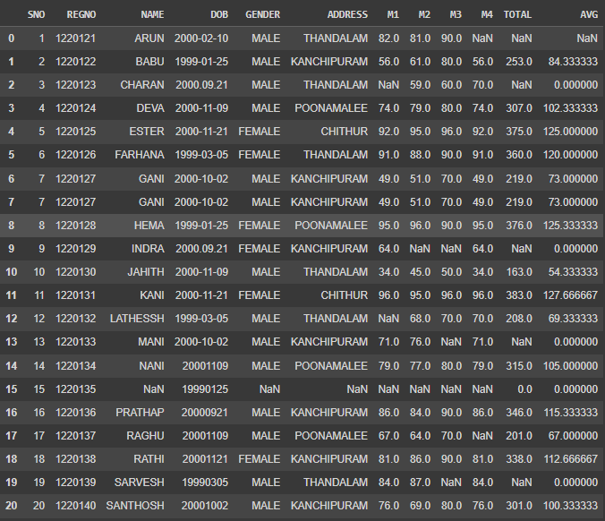
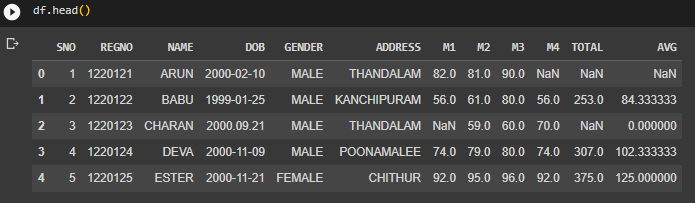
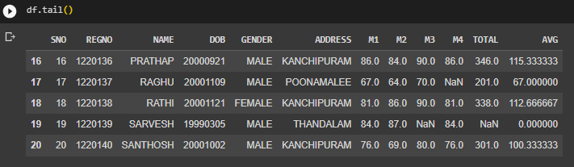
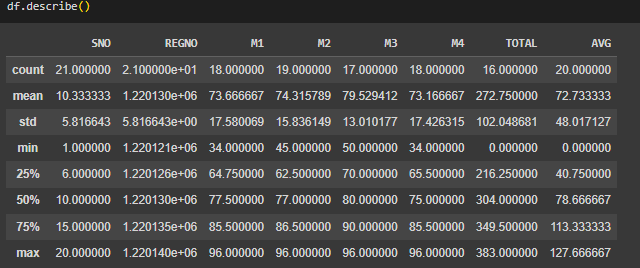
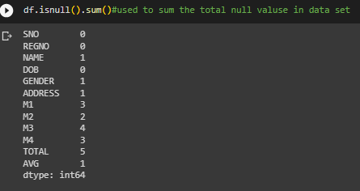
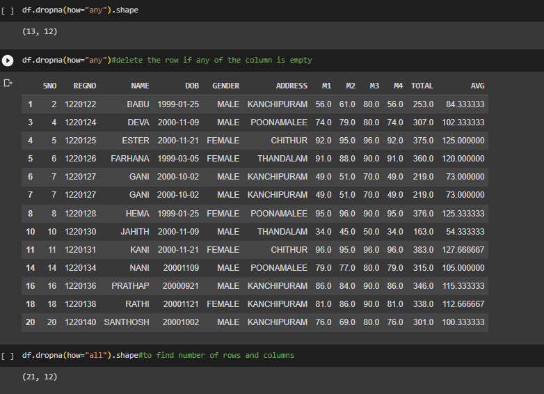
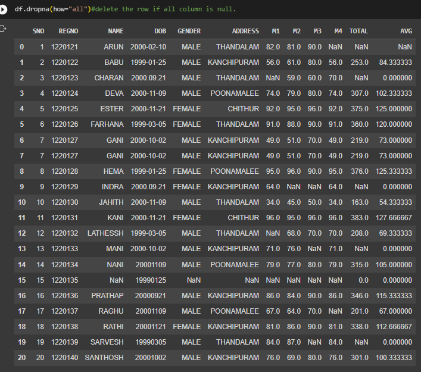
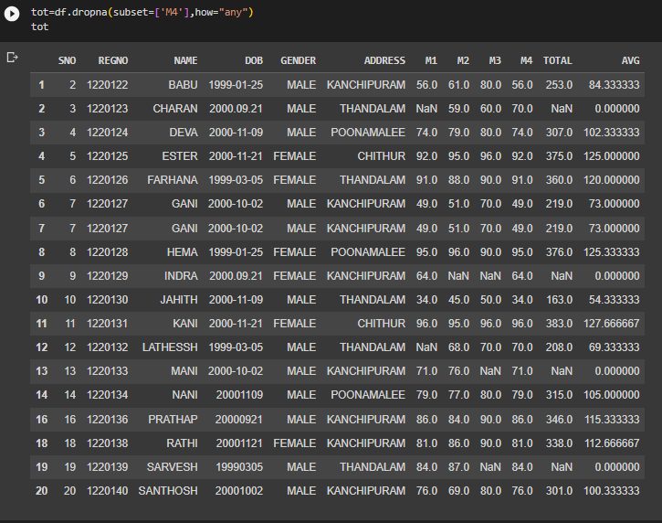
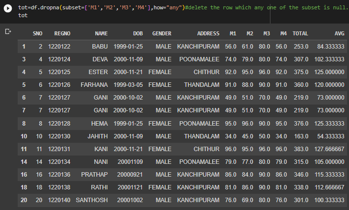
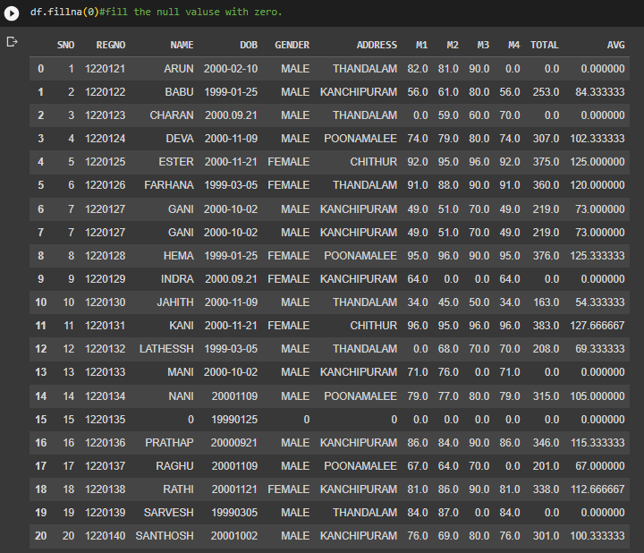
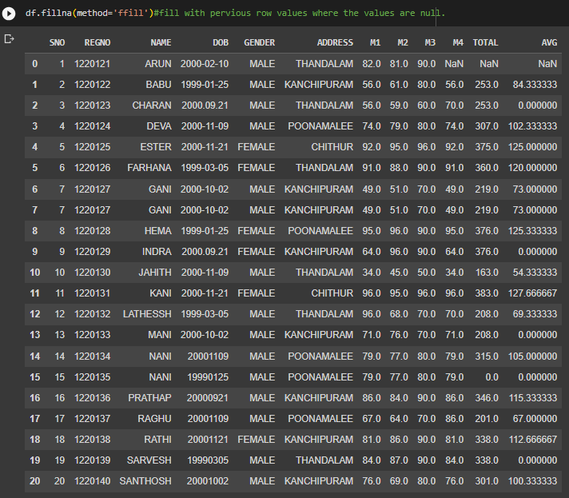
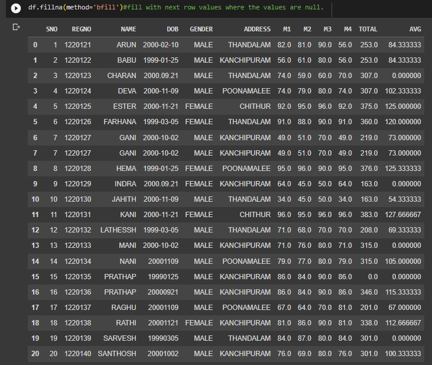
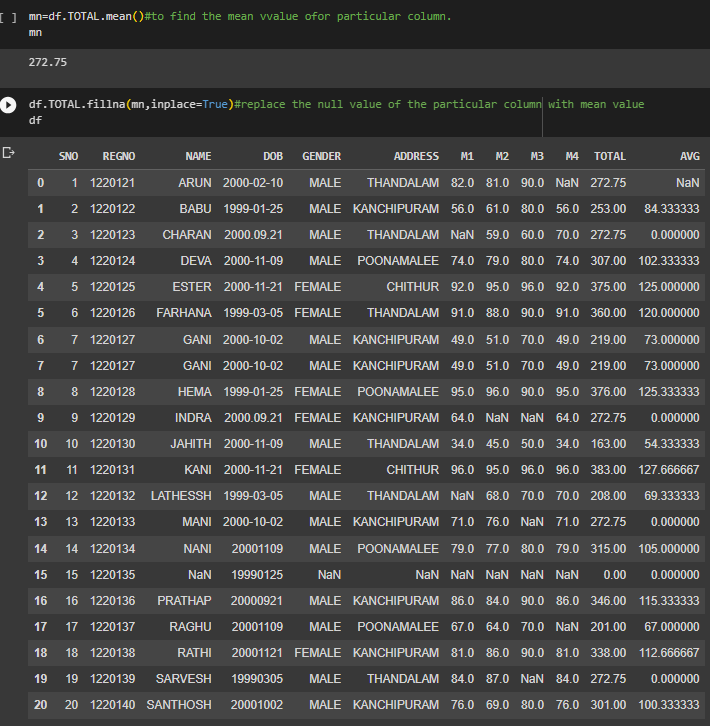
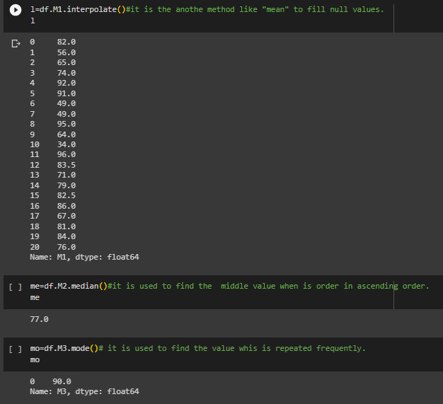
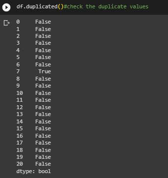
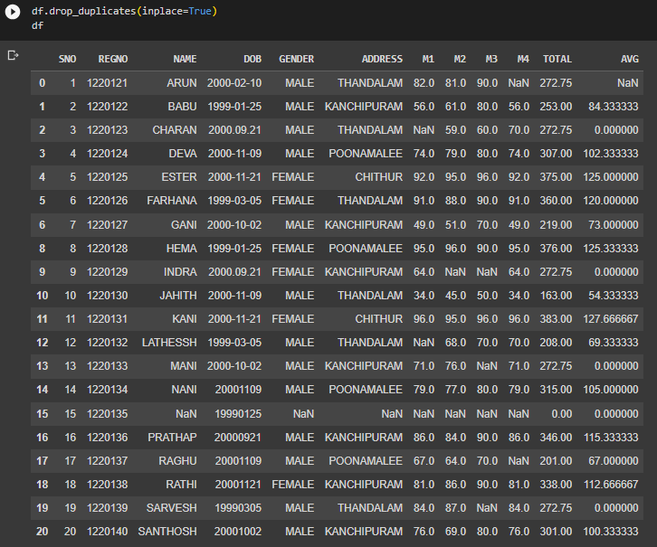
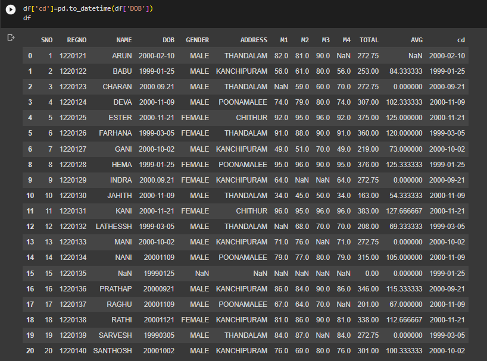
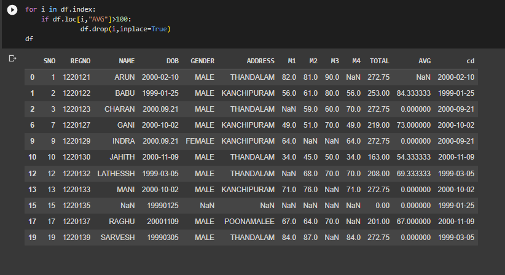

